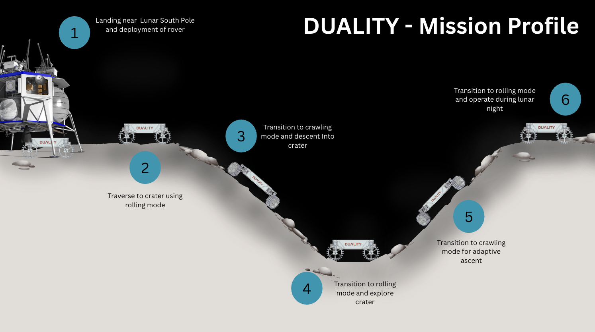

# DUALITY
Duality is a multi-modal rover created for AE 4322: Space System Design II.

## Access
Open the Windows Powershell Terminal on your device. **Note**: your device must be on the same wifi network as the duality-rpi.

Enter this command in the terminal (without the brackets):
```
ssh duality@[IP ADDRESS OF PI]
```
For example **(THIS SHOULD WORK FOR THE MOBILE ROUTER)**:
```
ssh duality@192.168.8.157
```
The first time you connect, it will ask you to trust the pi's ip address. Type ```yes``` and hit enter.

Enter this password (**Note**: it will not show as you type it): duality2026

Open this GitHub directory using the following command:
```
cd dualityMMR
```
Update the current software with this command:
```
git pull
```
Open the virtual environment with this command:
```
source venv/bin/activate
```
Now you should be able to run any program present in this repository. To see a list of the current directory, use the following command:
```
ls
```
You can use the `cd` command to get to any location in the current directory. and `cd ..` to move up a level.

To run a program, make sure you put `python` in front of the filename.
```
python testing.py
```

## Troubleshooting
If you get an error that "host connection timed out": 1) pi isnt powered 2) pi not connected to router 3) you are not connected to router 4) typed ip address wrong 5) wrong ip address altogether.

If you get an error that says a module is missing or cannot be found, try this:
```
cd documents
pip install -r requirements.txt
```


